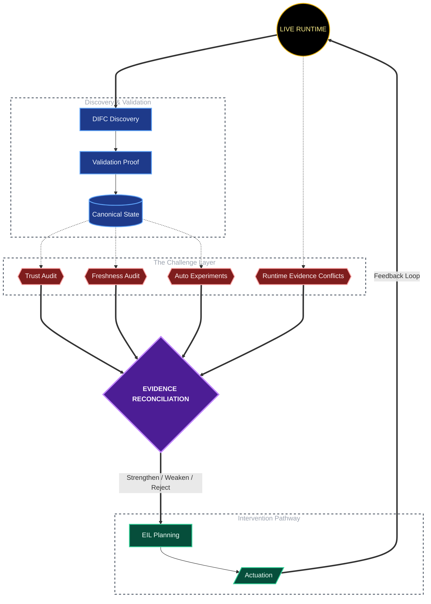

# 🧠 EBIS (Engine Behavior Intelligence System)

**An experimental self-correcting causal intelligence framework for dynamic systems.**


Unlike traditional analytics that stop at correlation, or static causal systems that treat discovered edges as permanent truth, **EBIS treats every causal belief as provisional.** It continuously challenges its own causal graph using statistical evidence, physics constraints, autonomous experiments, trust signals, and runtime feedback. A discovered relationship is never considered "true"—it must *earn* the right to be believed.

---

## 🎯 Core Philosophy

* **Traditional analytics asks:** *Which variables correlate?*
* **Traditional causal systems ask:** *What causes what?*
* **EBIS asks:** *Why should I continue believing this causal relationship is true?*

The objective is not just to maintain a causal graph, but to maintain a causal graph that **survives attack from reality**. 
✅ Causal beliefs are provisional, not permanent.
✅ No edge is sacred just because it was discovered.
✅ Discovery is the beginning of an investigation, not the end.

---

## 🏗 Runtime Architecture

EBIS operates through iterative evidence accumulation rather than a fixed pipeline. The architecture is divided into the following specialized modules:

| Module | Name | Responsibility |
| :--- | :--- | :--- |
| **CRE** | Continuous Runtime Engine | Real-time orchestration and continuous engine simulation. |
| **DIFC** | Dynamic Causal Discovery | 8-stage causal graph discovery (difc_v3). |
| **SBL** | System Behavior Learner | Physics & behavior learning (powered by 12 physics templates). |
| **ACIS** | Decision Authority System | Decision governance (11 authorities). |
| **AEX** | Autonomous Experiment Engine | Controlled, node-level perturbations and experimentation. |
| **EIL** | Experiment & Intervention Layer | Actuation, stabilization, and runtime feedback. |

---

## 🚀 Runtime Cycle & Evidence Accumulation

EBIS does not rely solely on statistical significance ($R^2$ or t-stats). Evidence must survive physics checks, experimental feedback, freshness audits, and trust evaluations. High statistical confidence does not automatically imply high trust.



### 💻 Example Runtime Reality
EBIS is designed for a live, interactive CLI environment where operators can query engine states, analyze variables, and command autonomous experiments.

```text
════════════════════════════════════════════════════════════
  EBIS BOOT VERIFIED
════════════════════════════════════════════════════════════
version    : v22
signature  : a789e41679244c1c
files      : 42 tracked
modules    : 7/7 imports passing
```
### 1️⃣ **Initiating Engine and Analysis**

> *Starting the continuous runtime engine and pre-loading the combustion cycles into the live buffer.*

```text
You: engine chalao
[engine] building kernel...
[engine] warming up (25 cycles)...
[engine] live — 5 cycles in buffer

ENGINE VIEWPORT
Status: RUNNING
Cycle : 12490
RPM   : 4000
CA50  : +3.4°
Spark : 24.6°
Knock : 🔴HIGH
Osc   : 1.00
```

### 🔍 **Investigating CA50 Causality**

> *Dynamic tracking of `ca50` drivers across multiple operating regimes, highlighting competing effects and latent confounds.*

```text
You: ca50 ascii

EBIS COGNITION MAP
Branch: drivers investigation
Trail:  drivers investigation → latent investigation → drivers investigation
Root:   ca50 investigation
──────────────────────────────────────────────────────────────
ca50
├── ← ✓ burn duration  +0.801  [? 0.84] v  DORMANT  seen=7x 3rg
├── ← ✓ spark angle deg  +0.614  [? 0.63] =  DORMANT  seen=3x
│
causes:
└── → ✓ knock intensity  -0.946  [? 0.92]  [~latent]
──────────────────────────────────────────────────────────────
```

### 2️⃣ **Generating a Cognition Map**

> *EBIS separates genuine causality from confounded effects, tagging hidden variables and latent causes dynamically.*

```text
You: knock ascii

EBIS COGNITION MAP
Branch: spark causality
Trail:  drivers investigation → latent investigation → drivers investigation → spark causality
Root:   knock investigation
──────────────────────────────────────────────────────────────
knock
├── ← ✓ ca50  -0.953  [? 0.92] =  DORMANT  seen=5x  [~latent]
├── ← ✓ turbulence intensity  -0.464  [? 0.70] v  DORMANT  seen=2x  [~latent]
├── ← ✓ residual fraction  -0.220  [? 0.61]  DORMANT  seen=1x
│
causes:
├── → ✓ mean flame speed  +0.792  [? 0.66]
└── → ✓ volumetric efficiency  +0.487  [? 0.42]  [~latent]
──────────────────────────────────────────────────────────────
```
### 👁️ **Live Observer Telemetry (DIFC Pipeline)**

> *The runtime Observer continuously monitors and reports the live state of the Dynamic Causal Discovery (DIFC) process, tracking how raw engine cycles are filtered, validated, and committed into the cognition map.*

```text
You: re-run DIFC

→ Re-running DIFC on current buffer (200 cycles)...

  [observer] DIFC running (manual trigger) — analyzing causal structure...
  [observer] ca50: raw=17 valid=10 accepted=2 unknown=7 rejected=8 committed=9
  [observer] volumetric_efficiency: raw=3 valid=0 accepted=0 unknown=1 rejected=2 committed=1
  [observer] knock_intensity: raw=21 valid=12 accepted=2 unknown=10 rejected=9 committed=12
  [observer] burn_duration: raw=9 valid=3 accepted=0 unknown=5 rejected=4 committed=5

  [observer] DIFC complete — causal structure updated
```
### 🛡️ **Statistical Validity vs. Causal Trust**

> *This is the core philosophy of EBIS in action: **Statistical validation does not guarantee trust.** An edge can be mathematically `[VALID]` but marked as `trust:UNRELIABLE` if the evidence is sparse, single-regime, or hasn't yet survived autonomous experimental auditing. Furthermore, causality is strictly time-bound—edges degrade to `[STALE]` as new engine cycles stream in, forcing continuous re-discovery.*

```text
You: causal structure

  ─ Causal structure for ca50 (6 edges)  [STALE] ─
    ⚠ edges stale (160 cycles old) — re-run DIFC
    ca50                     → knock_intensity           w=-0.953  [VALID]  trust:UNRELIABLE
    burn_duration            → ca50                      w=+0.819  [VALID]  trust:UNRELIABLE
    turbulence_intensity     → ca50                      w=+0.654  [VALID]  trust:UNRELIABLE
    spark_angle_deg          → ca50                      w=+0.609  [VALID]  trust:UNRELIABLE
    volumetric_efficiency    → ca50                      w=+0.523  [NEAR_ZERO]  trust:UNRELIABLE
    residual_fraction        → ca50                      w=+0.450  [NEAR_ZERO]  trust:UNRELIABLE

  ─ Causal structure for volumetric_efficiency (3 edges)  [STALE] ─
    ⚠ edges stale (160 cycles old) — re-run DIFC
    volumetric_efficiency    → ca50                      w=+0.523  [NEAR_ZERO]  trust:UNRELIABLE
    volumetric_efficiency    → mean_flame_speed          w=+0.496  [NEAR_ZERO]  trust:UNRELIABLE
    knock_intensity          → volumetric_efficiency     w=+0.487  [VALID]  trust:UNRELIABLE

  ─ Causal structure for knock_intensity (5 edges)  [STALE] ─
    ⚠ edges stale (160 cycles old) — re-run DIFC
    ca50                     → knock_intensity           w=-0.953  [VALID]  trust:UNRELIABLE
    knock_intensity          → mean_flame_speed          w=+0.792  [VALID]  trust:UNRELIABLE
    knock_intensity          → volumetric_efficiency     w=+0.487  [VALID]  trust:UNRELIABLE
    turbulence_intensity     → knock_intensity           w=-0.464  [VALID]  trust:UNRELIABLE
    residual_fraction        → knock_intensity           w=-0.220  [VALID]  trust:UNRELIABLE

  ─ Causal structure for burn_duration (2 edges)  [STALE] ─
    ⚠ edges stale (160 cycles old) — re-run DIFC
    burn_duration            → ca50                      w=+0.819  [VALID]  trust:UNRELIABLE
    turbulence_intensity     → burn_duration             w=+0.436  [NEAR_ZERO]  trust:UNRELIABLE
```

### 🧮 **Multi-Step Causal Validation (Proof Generation)**

> *Before an edge is granted the **`[VALID]`** status, EBIS subjects it to a rigorous multi-step proof. This includes ElasticNet regression, block-bootstrap significance testing, dynamic threshold derivation, hard physics consensus checks, and lifetime evidence tracking across multiple engine regimes.*

```text
You: burn ka proof

  ──────────────────────────────────────────────────────────
  ✓  Proof: burn → ca50
  burn_duration → ca50:  weight = +0.8015  R²=0.987  [VALID]
  ──────────────────────────────────────────────────────────

  STEP 1 — ElasticNet regression  (n=200 cycles)
  β_raw  = 3.913263
  R²     = 0.9872  (98.7% variance explained)
  weight = +0.8015  (standardized)

  STEP 2 — Bootstrap significance test
  n_boot   = 50  block_size=5  (Politis 1994)
  t_stat   = 7.68
  t_crit   = 2.0084  (α=0.05)
  → significant (t=7.680>t_crit=2.0084) + 99% variance
  bootstrap_std = 0.0000 (stable)  sign_s = 1.0

  STEP 3 — Threshold derivation
  kappa_max         : BASE_κ=3.674×√(n/p)=√(200/3) → 30.0 [clamp 5–100]
  outlier_thresh    : 0.707/√200 → 0.0500 [clamp 0.02–0.12]
  max_cv            : t(49)=2.0084/√50×√9×0.5 → 0.4260 [clamp 0.20–0.55]
  t_crit_boot       : t(49,α=0.05)=2.0084 → bootstrap t-test replaces fixed MIN_EFFECT

  STEP 4 — Physics check
  ✓ Known physics: burn_duration → ca50 is direct causal relationship
  consensus = 0.839  [VALID]

  STEP 4b — Lifetime evidence
  seen = 7x across runs  ·  lifetime weight ~+0.907 (EMA)  ·  trend: weaker
  regimes: rpm2000, rpm4000, rpm5000 (regime-dependent)
```
### 3️⃣ **Autonomous Experimentation & Stabilization**

> *When stability is lost (e.g., **`ca50`** oscillation), EBIS isolates controllable sources, perturbs actuator surfaces, and multi-path stabilizes the engine.*

```text
You: stable karo
→ Auto-stabilization: ca50

STABILIZATION PROOF
────────────────────────────────────────────────────────
Problem (Observer):  ca50=-0.0° osc=1.00
Cause (Canonical):   burn_duration → ca50  R²=0.9864
Path (EIL):          ca50 ← burn
Decision (EIL):      actuate phasing/trim_application_gain
Authority:           EIL+canonical+hub
────────────────────────────────────────────────────────
[verify] MULTI-OBJECTIVE PASS: ca50 stabilized, knock not worsened
```
### 🔄 **Asynchronous DIFC Execution & Auditing**

> *Operators can trigger causal discovery manually and monitor its background lifecycle. EBIS tracks the snapshot and active targets seamlessly without halting the core engine.*

```text
You: re run difc
→ Manual DIFC triggered (200 cycles in buffer)
Analysis running in background...

You: difc status

─ DIFC STATUS ─
  lifecycle:       RUNNING  (—)
  running:         True
  cycle:           6445
  completed_at:    1955
  active_targets:  ['ca50', 'volumetric_efficiency', 'knock_intensity', 'burn_duration']
  per_target:      ['ca50', 'volumetric_efficiency', 'knock_intensity', 'burn_duration']
  snapshot:        snap_1780158117207_33a377
  edges:           6 VALID of 10 total
```
### 🛑 **Live Telemetry & Graceful Engine Shutdown**

> *The system allows real-time querying of the combustion parameters (like CA50, Knock, and AFR) and memory sensitivity. Upon command, the engine halts gracefully, freezing the buffer at its exact last state for post-mortem analysis.*

```text
You: engine status

Live engine state (6480 cycles):

CA50   2.85°  (±5.673°)
knock  18.261  trend: rising
AFR    14.7  spark θ332.0

Dominant affected node: ca50  (pressure=1.5885)
Computed from 6480 live cycles.
ca50                                    : 1.5885
knock_intensity                         : 0.0547
volumetric_efficiency                   : 0.0000
Sensitivity memory: 19 measured  1 regimes

You: engine stop

──────────────────────────────────────────────────────────
→  Engine stopped
user request
──────────────────────────────────────────────────────────
Engine halted. Buffer frozen at last state.
~ knock elevated (19.35) — top driver: ca50
```
### 🔬 **Current Research Challenges**

> **EBIS is in an active phase of R&D. Current open problems include:**

* **`[Experiment ↔ DIFC Calibration]`**: *Bridging actuator/node-level perturbations with variable-level causal effects.*
* **`[Trust Calibration]`**: *Coherently combining statistical evidence, regime coverage, experimental agreement, and freshness status.*
* **`[Multi-Actuator Stabilization]`**: *Achieving sustained engine stabilization across shifting RPM regimes (e.g., **2000 → 5000 RPM** transitions).*
* **`[Latent Cause Detection]`**: *Identifying single-regime evidence and separating genuine causality from confounded (hidden) variables.*
* **`[Evidence Integration]`**: *Handling conflicting data points dynamically.*

---

### ⚠ **Availability**

* **Status:** **`Private Experimental Research System`**
* *Installation, source code, and public runtime access are restricted at this time.*

> ### *"Reality is the ultimate auditor. EBIS exists because no causal graph deserves to live on reputation alone."*

